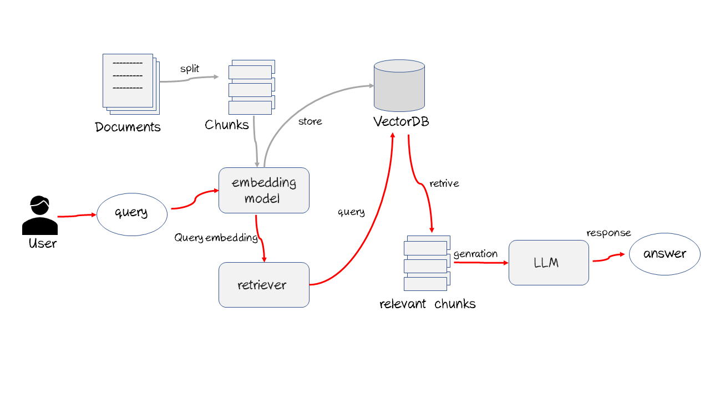

# Process Description

- Split: RAG begins with turning your structured or unstructured documents into text documents, and breaking down text into small pieces (chunks).
- Embed documents: A text embedding model steps in, turning each chunk into vectors representing their semantic meaning.
- VectorDB: These embeddings are then stored in a vector database, serving as the foundation for data retrieval.
- Retrieval: Upon receiving a user query, the vector database helps retrieve chunks relevant to the user's request.
- Response Generation: With context, an LLM synthesizes these pieces to generate a coherent and informative response.
